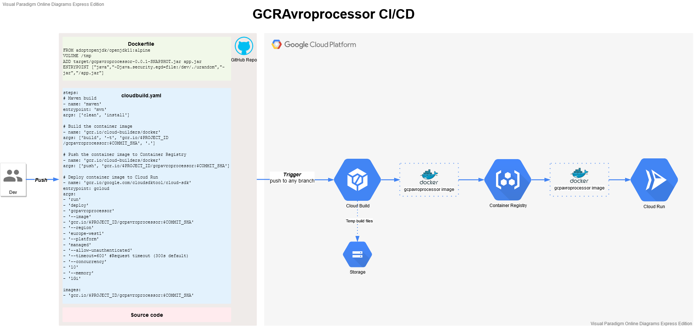
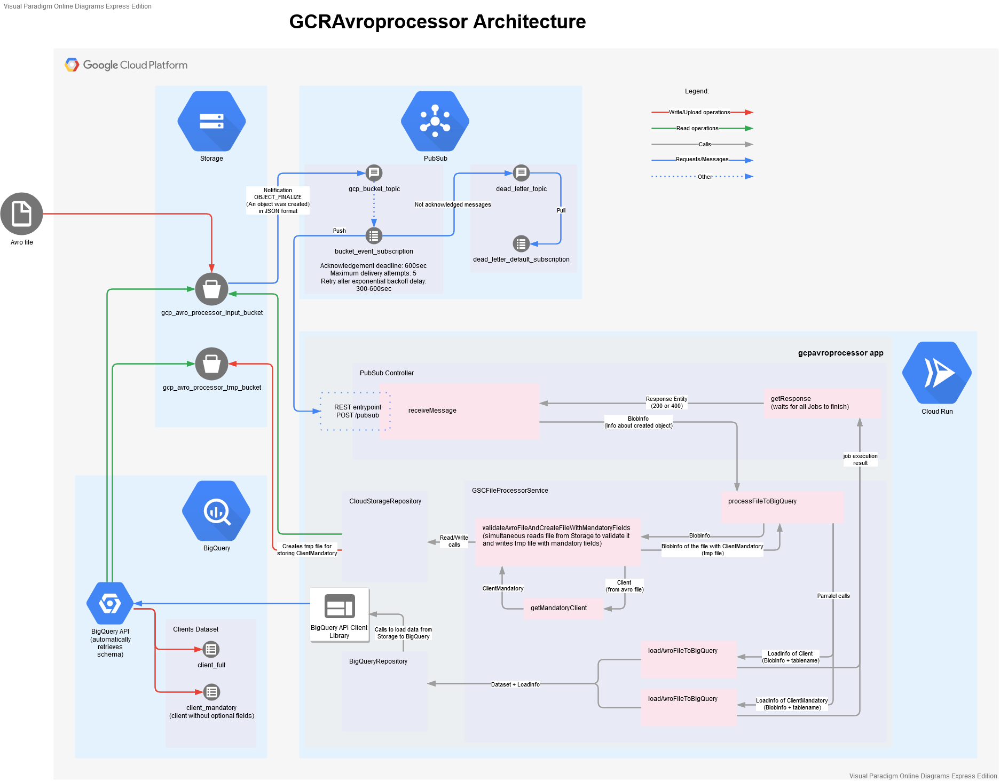

**The main purpose of this application is to process uploaded avro files from Google Storage to Google BigQuery.**

_Application uses following Google services: Cloud Build, Container Registry, Storage, Cloud Run, PubSub, BigQuery._

The GCRAvroprocessor application, hosted on Cloud Run, starts processing avro file as soon as it is uploaded to Storage input bucket. An upload event triggers notification message for PubSub topic. These messages are pushed by PubSub subscription to the application REST endpoint to start processing. GCRAvroprocessor is a backend service which parses avro file (according to specific schema) and stores new temporary file in Storage with mandatory data fields only. After that both files are sent to BigQuery using its API to load data into two separate tables in parallel threads. After loading temporary file will be deleted.

Please check image below for CI/CD details:
 

Please check image below for architecture details:

